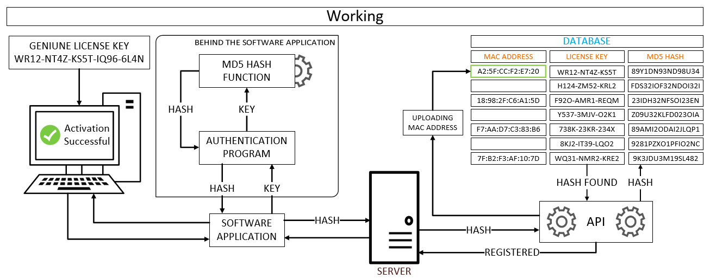
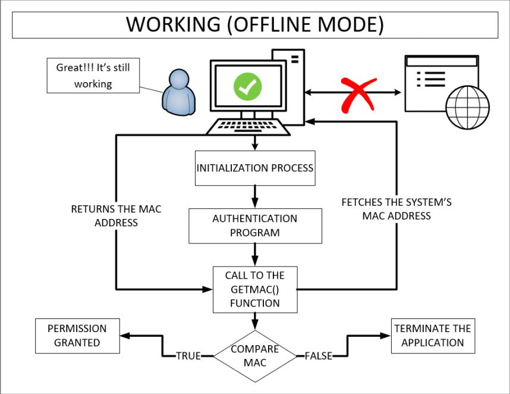
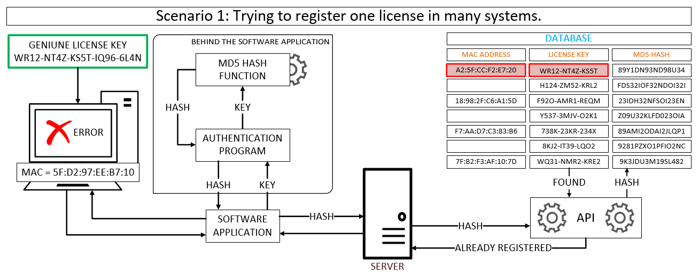
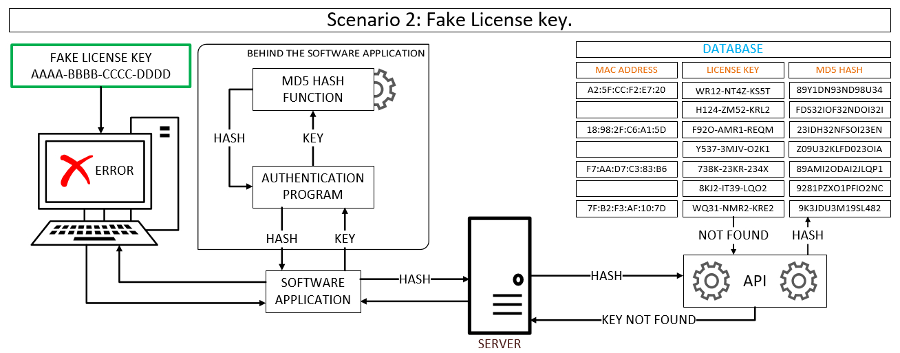

<html lang="en">
<head>
  <meta charset="UTF-8">
  <meta name="viewport" content="width=device-width, initial-scale=1.0">
  <title>Software Piracy Protection System</title>
  <h1>
Software Piracy Protection System
</h1>
</head>
<body>
<h3><u>Introduction</u></h3>

  The project is intended to stop the piracy of software applications. A methodology is embedded in the software application, which can protect any software from piracy. This methodology includes using of authentication server for license key authorization and registration of license key with corresponding MAC address. The methodology utilizes authentication server checks and registers the MAC address of the user. This methodology works well even in the offline mode and does not allow any counterfeit(fake) copy of the software application to run on any other computer. Authentication and registration of software applications are done only during the installation of the software application. Once the installation is successful then the MAC address is used for offline authentication, so its copy cannot run on any other computer.

<h3><u>How it Works</u></h3>

The proposed methodology can be embedded into any software application to prevent it from piracy, it works in the following way:-
During the installation, setup requires an active internet connection for the successful completion of the installation of software.
When the genuine license key is entered into the software application. The license key is fed to the authentication program and subsequently, the key is again fed to the MD5 hash function for the encryption of the key to protect the license key over the internet. After encryption, the encrypted hash is returned to the Software application and then the application transmits the hash to the authentication server and from there it goes to the API and the API looks for the Hash (received from the client) in the database. The Server consist of a database that keeps the list of all valid license Keys and their corresponding MD5 hash, moreover
these License keys are associated with a MAC address of the user, who wants to register their genuine copy of the software application.

  <b>General Working</b>: The license key received by the API from the client PC is present in the database and there is no MAC address associated with it. It means the license key received has never been
  registered and it’s a genuine registration which should be allowed, and API asks the client
  application to send its MAC address to register in the database to avoid duplicate registration.
  

  <b>Offline Mode</b>: When the software application is successfully installed, an internet connection is not required for the software to run, now the question arises that if somebody copies the installed software application and try to run on another computer. Still, the software application will run only on the system for which it was registered because every time the software boots up, the MAC
  address registered into the software application at the time of installation is matched with the current system’s MAC address. Therefore running that application on any other system will not work since every system has a unique MAC address.
  

<h3><u>Different Scenarios</u></h3>

Following are two scenarios.

<b>Scenario 1</b>: The license key received by API from Client PC is present in the database, but
there is a MAC address already registered with it. This means that the license key has already been
registered to a PC and the MAC address belongs to that PC in which it is registered. Therefore, the
API will not allow the client’s application to register. Hence if the registration fails, the installation also fails.

<b>Scenario 2</b>: The license key received by the API from the client PC is not present in the database
and it means that the license key is fake.  <b>Note :</b> The genuine and valid license key are present in the server.

<h3><u>Quick Glance</u></h3>
<video width="640" height="480" controls preload> 
  <source src="res/Softwarepiracy-1.webm"></source> 
</video>
</body>
</html>
